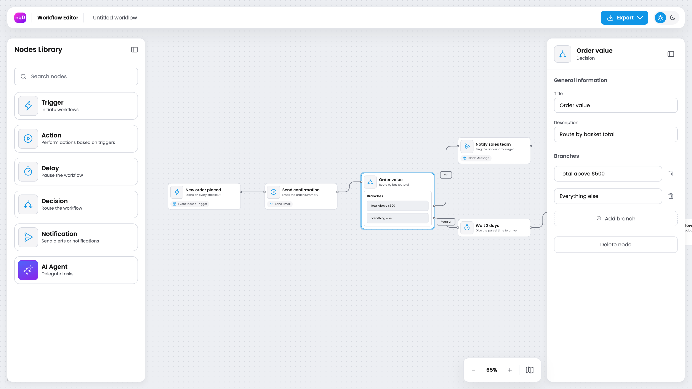

# ngDiagram Workflow Editor Template

[](https://opensource.org/licenses/MIT)



Interactive workflow / automation editor built with Angular and [ngDiagram](https://www.ngdiagram.dev/). Drag triggers, actions, delays, decisions, approvals, merges, notifications and AI agents onto a canvas, connect them and edit their settings in a side panel. Use this project as a starting point for building your own low-code flow designer, automation builder or node-based editor. Lean dependencies: Angular, ngDiagram, [Phosphor Icons](https://phosphoricons.com/) (web font) and [html-to-image](https://www.npmjs.com/package/html-to-image) (for JPEG export) — no opinionated third-party UI libraries.

Features:

- Drag-and-drop node placement from a searchable **Nodes Library** — each tile is a live preview of the node card
- Eight node types, all described by one **data-driven catalog**
- Custom node templates beyond the default card: **Decision** / **Approval** (one output port per branch) and **AI Agent** (shows the chosen chat model and memory)
- **Properties panel** built with Angular **Signal Forms** — fields come from the catalog, can be shown or hidden depending on other values, and changes appear on the node card as you type
- Labelled connections drawn as orthogonal edges with rounded corners; invalid connections are rejected (no self-loops, nothing can connect into a Trigger)
- Right-click **context menus** — copy / cut / paste / delete on a node, paste on the background
- **Export** as JSON (nodes and connections) or as a JPEG snapshot of the canvas
- Minimap and zoom controls; nodes snap to an 18px grid
- Dark / light theme driven by a design token system

## Node library

| Node         | Template   | Ports                    | Settings                                                     |
| ------------ | ---------- | ------------------------ | ------------------------------------------------------------ |
| Trigger      | `workflow` | output only (start node) | time-based (CRON expression) or event-based (matcher)        |
| Action       | `workflow` | in, out                  | action type, email fields, API call, retry, simulate failure |
| Delay        | `workflow` | in, out                  | delay in milliseconds                                        |
| Decision     | `decision` | in, one out per branch   | branches (add / rename / remove)                             |
| Approval     | `decision` | in, one out per branch   | approver, channel, timeout; Approved / Rejected branches     |
| Merge        | `workflow` | in (many), out           | continue when all branches finish or the first one does      |
| Notification | `workflow` | in, out                  | channel, recipient, message                                  |
| AI Agent     | `ai-agent` | in, out                  | chat model, memory, system prompt, simulate failure          |

Every node also has a Title and a Description.

The library is fully **data-driven**: every node type is one entry in
[`node-catalog.ts`](src/app/workflow-editor/diagram/model/node-catalog.ts)
describing its label, icon, template, form fields and default values. The palette
tile, the node card and the properties form all read from that entry.

## Getting Started

Built against Angular 22 and ngDiagram 1.3 (see `package.json`); Node.js 22+ and npm.

```bash
npm install
npm start
```

Open [http://localhost:4200](http://localhost:4200) — a sample workflow loads: an order-confirmation flow that emails the customer, branches on order value into a sales notification or a delay, then drafts and sends a follow-up with an AI agent (7 nodes, 6 connections). Try dragging a node from the library onto the canvas, wiring it into the flow and editing its settings in the properties panel. The sample workflow is seed data — replace it in [`diagram/data.ts`](src/app/workflow-editor/diagram/data.ts).

## Scripts

| Script                 | Description                       |
| ---------------------- | --------------------------------- |
| `npm start`            | Start the dev server (`ng serve`) |
| `npm run build`        | Production build to `dist/`       |
| `npm run watch`        | Development build in watch mode   |
| `npm test`             | Run unit tests (Vitest)           |
| `npm run lint`         | Lint with ESLint (`ng lint`)      |
| `npm run format`       | Format sources with Prettier      |
| `npm run format:check` | Check formatting without writing  |

## ngDiagram APIs demonstrated

| Concern               | API                                                                                         | Where in this repo                                    |
| --------------------- | ------------------------------------------------------------------------------------------- | ----------------------------------------------------- |
| Setup                 | `provideNgDiagram()`, `initializeModel()`                                                   | `pages/workflow-editor-page.component.ts`, `diagram/` |
| Node templates        | `NgDiagramNodeTemplateMap`, `NgDiagramNodeTemplate`, `NgDiagramPortComponent`               | `diagram/nodes/*`                                     |
| Dynamic ports         | one `ng-diagram-port` per decision branch                                                   | `diagram/nodes/decision-node/`                        |
| Edge template + label | `NgDiagramEdgeTemplateMap`, `NgDiagramBaseEdgeComponent`, `NgDiagramBaseEdgeLabelComponent` | `diagram/edges/label-edge/`                           |
| Connection rules      | `linking.validateConnection`, `finalEdgeDataBuilder`                                        | `diagram/diagram.component.ts`                        |
| Routing, snapping     | `edgeRouting.orthogonal`, `snapping`, `background`                                          | `diagram/diagram.component.ts`                        |
| Palette               | `NgDiagramPaletteItemComponent`, `NgDiagramPaletteItemPreviewComponent`                     | `palette-sidebar/components/palette-tile/`            |
| Model updates         | `NgDiagramModelService.updateNodeData / updateEdgeData / deleteEdges`                       | `properties-sidebar/properties-sidebar.service.ts`    |
| Selection             | `NgDiagramSelectionService`, `selectionGestureEnded`, `paletteItemDropped`                  | `properties-sidebar/`, `diagram/`                     |
| Clipboard             | `NgDiagramClipboardService`                                                                 | `diagram/editor-actions.service.ts`                   |
| Viewport, minimap     | `NgDiagramViewportService`, `NgDiagramMinimapComponent`                                     | `minimap-bar/`, `export/`                             |

## Architecture

```
src/
├── styles.css                        # global styles, imports ng-diagram + Phosphor + theme
├── workflow-theme.css                # --wf-* design tokens (light default, dark override) + --ngd-* remap
├── typography.css                    # Poppins type scale
└── app/workflow-editor/
    ├── workflow-editor.config.ts     # injectable editor config (zoom step, fit padding, grid size)
    ├── pages/                        # page shell: canvas + overlaid panels, provideNgDiagram()
    ├── diagram/
    │   ├── diagram.component.*       # ng-diagram host, config, template maps, events
    │   ├── data.ts                   # seed workflow
    │   ├── editor-actions.service.ts # copy / cut / paste / delete
    │   ├── model/                    # types, node catalog, field model, guards (+ specs)
    │   ├── nodes/                    # workflow, decision, ai-agent templates + shared header/icon
    │   └── edges/label-edge/         # labelled edge template
    ├── palette-sidebar/              # Nodes Library + draggable tiles
    ├── properties-sidebar/           # panel, Signal Forms for nodes / edges, icon select control
    ├── minimap-bar/                  # zoom stepper + minimap popover
    ├── context-menu/                 # node / background right-click menu
    ├── export/                       # JSON + JPEG export, navbar dropdown
    └── top-navbar/                   # logo, editable workflow name, export, theme toggle
```

The ng-diagram `node.type` selects the **template**, which controls the node's layout. `node.data.kind` says **what the node is**. This split lets Trigger, Action, Delay, Notification and Merge share one card template, Decision and Approval share the branching template, and AI Agent gets its own.

### Properties forms

[`node-properties.component.ts`](src/app/workflow-editor/properties-sidebar/components/node-properties/node-properties.component.ts) works in four steps:

1. It copies the selected node's data into a `linkedSignal`.
2. It wraps that copy with `form()` from `@angular/forms/signals`.
3. It binds each control with `[formField]`. The icon dropdown is a custom control that implements `FormValueControl<string>`.
4. An `effect` writes each change back with `updateNodeData`.

The field model in [`field-definitions.ts`](src/app/workflow-editor/diagram/model/field-definitions.ts) is deliberately tiny (text, textarea, select, switch, plus a `showIf` rule) — it shows the catalog-driven form pattern without rebuilding a schema engine.

### Design tokens

Every color is a `--wf-*` token defined per theme in
[`workflow-theme.css`](src/workflow-theme.css). The base `--ngd-*` tokens ship
with ngDiagram itself, so that file only adds the `--wf-*` tokens and remaps the
few `--ngd-*` variables that drive the on-canvas look.

## Customization

- **Add a node type:** add a value to `WorkflowNodeKind` in
  [`workflow-types.ts`](src/app/workflow-editor/diagram/model/workflow-types.ts),
  add a catalog entry (label, icon, `template`, `fields`, `defaults`) and add the
  kind to `PALETTE_ORDER`. The palette tile, node card and properties form pick
  it up automatically. For a custom layout, create a template component and
  register it in `nodeTemplateMap` in `diagram.component.ts`.
- **Icons:** use `ph-<name>` for any [Phosphor](https://phosphoricons.com/) icon.
  For your own SVGs in `src/assets/`, use `mask:<file>` for a single-colour icon
  or `img:<file>` for a full-colour one.
- **Change the seed workflow:** edit [`data.ts`](src/app/workflow-editor/diagram/data.ts).
- **Tune the editor:** edit `WORKFLOW_EDITOR_DEFAULTS` (zoom-to-fit padding,
  zoom step, grid size) in [`workflow-editor.config.ts`](src/app/workflow-editor/workflow-editor.config.ts),
  or override the `WORKFLOW_EDITOR_CONFIG` token in the page providers.
- **Theme:** adjust the `--wf-*` tokens in `workflow-theme.css`.

## Export format

[`export.service.ts`](src/app/workflow-editor/export/export.service.ts) offers
two formats: a **JPEG** raster snapshot of the canvas and **JSON**. The JSON is
an `ng-diagram-workflow` document — a `nodes` array (id, kind, position, label,
description, properties, and branches for decisions) plus a `connections` array
(port-to-port, with optional labels).

## Known limitations / notes

This template is a demo of the editor UI, not a workflow engine. It does not include:

- undo/redo
- persistence or import
- workflow validation
- auto-layout
- workflow execution

## Workflow Builder

Need more than an editor UI? [Workflow Builder](https://www.workflowbuilder.io/) is a complete workflow solution by Synergy Codes, including backend integration for storing and executing workflows. Visit [workflowbuilder.io](https://www.workflowbuilder.io/) to learn more.

## Tech stack

- [Angular 22](https://angular.dev) (standalone components, signals, zoneless, Signal Forms)
- **ngDiagram** ([`ng-diagram`](https://www.npmjs.com/package/ng-diagram) on npm)
- [Phosphor Icons](https://phosphoricons.com/) (web font)
- [html-to-image](https://www.npmjs.com/package/html-to-image) (JPEG export)
- Plain CSS with a custom design-token system (no UI framework)
- Poppins
- Vitest, ESLint, Prettier

## Support

- **ngDiagram Discussions**: [GitHub Discussions](https://github.com/synergycodes/ng-diagram/discussions), [Discord](https://discord.gg/FDMjRuarFb)
- **ngDiagram Documentation**: [ngdiagram.dev/docs](https://www.ngdiagram.dev/docs)

## License

MIT — see [LICENSE](LICENSE).

---

Built with ❤️ by the [Synergy Codes](https://www.synergycodes.com/) team
